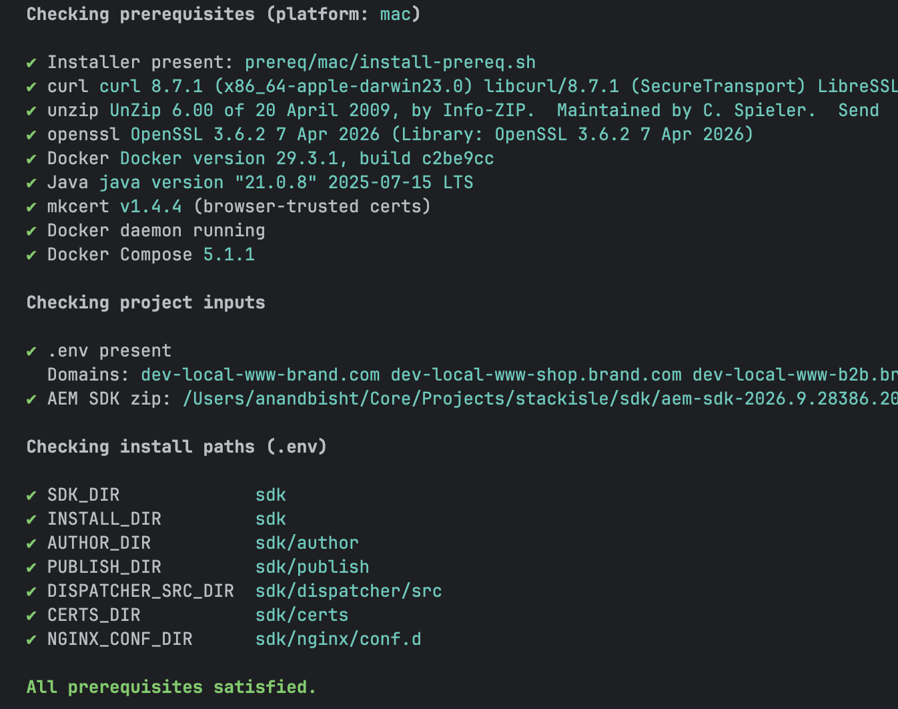
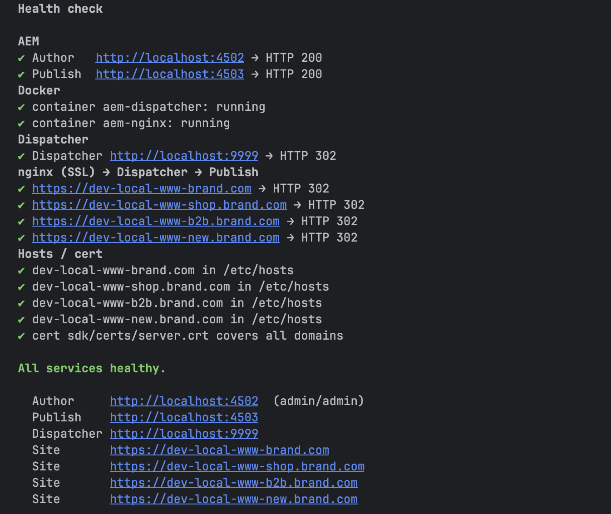
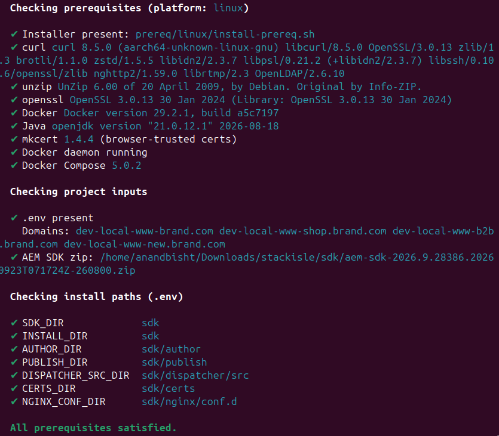
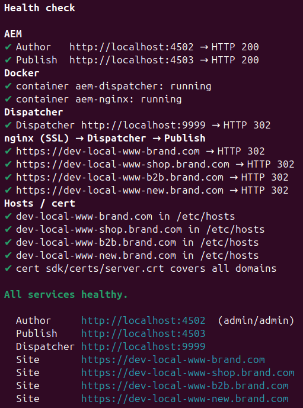
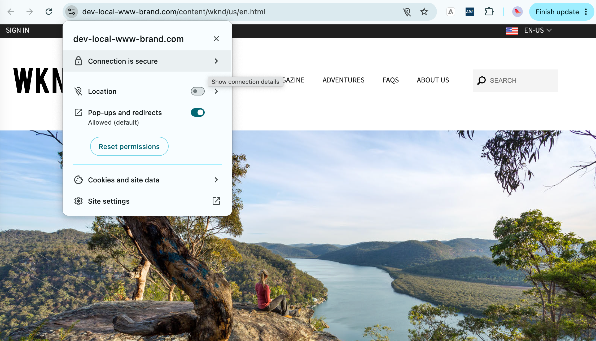

# Stackisle
Your isolated local island of services.
- AEMaaCS
- Magento (ACaaCS)
- Docker
- Kubernetes
- Terraform
...and more!

The starting reference point is from the AEMaaCS.

## Why Stackisle — one setup for every developer

Every developer, in every team, runs the same stack as the cloud ie AEM Author and Publish,
the Dispatcher and HTTPS on the real site domains. What works on the developer machine
works when the code is merged — no "works on my machine", no surprises in the shared cloud environments.

- **Same setup for all** — one command (`make`) builds the identical environment on macOS,
  Linux and Windows. New joiners are productive on day one, not in week two.
- **Cloud-like, locally** — HTTPS domain → Dispatcher → Publish, the same path the visitor
  takes. Caching, filters, rewrites and redirects are tested before the merge, not after the deploy.
- **Cloud environments are limited** — AEMaaCS environments are few and shared; one per
  developer is not cost-effective. Stackisle gives every developer a full stack of their own
  at no cloud cost, and keeps the shared environments for integration and UAT.
- **Faster delivery** — fewer failed pipelines, fewer blocked environments, fewer late defects.
  Estimated **~40% productivity gain** for the overall team.
- **Built for enterprise scale** — critical for complex projects with multiple teams, brands and
  domains, delivered at true global scale, where everyone must build and test on the same baseline.

**Start here** — Stackisle is the starting point for every project to clone, add to it own repo as needed and the SDK, run `make`. An opportunity to enhance and make it your own playbook by partnering with the [Claude.ai skills](./.claude/skills/SKILL.md).

# Preview 
**MacOS**

`make prereq`



`make health`



**Linux**

`pre-check` 



`make health`



`https://dev-local-www-brand.com`


# AEM local DEV environment

One-command setup for a fully local AEMaaCS development environment on macOS, Windows, and Linux.

## What this sets up

```
Browser → https://dev-local-www-brand.com
           [nginx container]        INSTALL_DIR/certs/server.crt, INSTALL_DIR/nginx/conf.d/
             → aem-dispatcher:80    (host: http://localhost:9999)
                [Dispatcher container]  INSTALL_DIR/dispatcher/src/
                  → host.docker.internal:4503
                     AEM Publish (local Java process)   AEM Author :4502 alongside
```

### Sites (via nginx SSL)

Browse these — no port needed. nginx (Docker) terminates SSL and forwards to the
dispatcher and AEM Publish behind it.

| Site URL                              |
|---------------------------------------|
| https://dev-local-www-brand.com       |
| https://dev-local-www-shop.brand.com  |
| https://dev-local-www-b2b.brand.com   |
| https://dev-local-www-new.brand.com   |

One row per domain in `CUSTOM_DOMAINS` (`.env`). To add a site, see [Adding a domain](#adding-a-domain).

### Backend services (direct access for development)

| Service     | URL                    | Runs as                           |
|-------------|------------------------|-----------------------------------|
| AEM Author  | http://localhost:4502  | Java 21 process, `author,local` — admin/admin |
| AEM Publish | http://localhost:4503  | Java 21 process, `publish,local`  |
| Dispatcher  | http://localhost:9999  | Docker `aem-dispatcher` → Publish |

## Prerequisites

- Docker (Desktop on mac/windows) with compose v2, **Java 21+** (AEM SDK 2026.x refuses to start on 17), curl, unzip, openssl; mkcert optional (trusted certs)
- `make install-prereq` installs them on mac/linux; Windows: `powershell -File prereq/windows/install-prereq.ps1` (Admin), then use Git Bash
- The AEM SDK zip from [Adobe Software Distribution](https://experience.adobe.com/#/downloads/content/software-distribution/en/aemcloud.html)
  (sign in with your Adobe ID; search "AEM SDK"), placed at `sdk/aem-sdk-<version>.zip`
  (you should have access and the dispatcher tools are inside it — nothing else to download)

## Quick start

First time? Follow **[docs/setup-guide.md](docs/setup-guide.md)**. It runs every step one at a
time, with what each does, how to check it, and how to undo it.

```bash
cp .env.example .env     # optional — `make` creates it; edit CUSTOM_DOMAINS / ports
make                     # prereq → sdk → certs → dispatcher → nginx → hosts → start → wait
make help                # every target
```

## Where things are installed

Two variables in `.env` decide everything:

```bash
SDK_DIR="./sdk"       # The path of the SDK container (put aem-sdk-<version>.zip here)
INSTALL_DIR="./sdk"   # The path you want to install
```

| Derived from `INSTALL_DIR` | Contents |
|---|---|
| `author/`, `publish/` | AEM jars + `crx-quickstart` (repository, logs) |
| `dispatcher/src/` | Dispatcher vhost/farm config (seeded from the SDK) |
| `dispatcher/docker/`, `dispatcher/logs/` | Resolved image, saved logs |
| `certs/` | `server.crt`, `server.key` |
| `nginx/conf.d/` | Generated nginx server blocks |

Relative paths resolve from the project folder; absolute paths (`/opt/aem`) and `~` work too.

```bash
make set-paths INSTALL_DIR=/opt/aem                  # change one…
make set-paths SDK_DIR=./sdk INSTALL_DIR=~/aem-local # …or both (writes .env)
make paths                                           # show the layout (read-only)
make prereq                                          # check the folders are writable
```
Changing paths doesn't move an existing install. `set-paths` warns and explains the options.

## Step-by-step

| make target       | Script                                            | What it does                                        |
|-------------------|---------------------------------------------------|-----------------------------------------------------|
| `help`            | built into `Makefile`                             | List all targets                                    |
| `env`             | built into `Makefile`                             | Create `.env` from `.env.example` (if missing)      |
| `set-paths`       | `set-paths.sh`                                    | Set `SDK_DIR` / `INSTALL_DIR` in `.env`             |
| `prereq`          | `00-check-prereq.sh`                              | Verify tools, Java 21+, Docker daemon, SDK zip      |
| `sdk`             | `01-unpack-sdk.sh`, `02-create-author-publish.sh` | Unpack SDK, create author/ + publish/               |
| `certs`           | `03-create-cert.sh`                               | `certs/server.crt/.key` for all domains             |
| `dispatcher`      | `04-install-dispatcher.sh`                        | Dispatcher tools, seed `dispatcher/src`, load image |
| `nginx`           | `05-create-nginx-config.sh`                       | `nginx/conf.d/<domain>.conf`                        |
| `hosts`           | `update-etc-hosts.sh`                             | Map domains → 127.0.0.1                             |
| `start`           | `06`, `07`, `08`                                  | Start AEM, dispatcher, nginx                        |
| `health` / `wait` | `09-health-check.sh`                              | Check every hop / poll until healthy                |
| `make`            | all of the above                                  | One command to install and start all above services |
| `stop`            | `08`, `07`, `06` (stop)                           | Graceful stop of all services                       |

# Refer detailed step by step command guide
from [./docs/setup-guide.md](./docs/setup-guide.md)

## Adding a domain

```bash
# .env
CUSTOM_DOMAINS="dev-local-www-brand.com dev-local-www-shop.brand.com dev-local-www-b2b.brand.com dev-local-www-new.brand.com dev-local-www-promo.brand.com"

make certs nginx hosts reload-nginx
```
The dispatcher's default config accepts every host (`*`), so no dispatcher change is
needed. For per-domain vhosts, see `.claude/skills/references/dispatcher-config.md`.

## Day to day

```bash
make start | stop | restart | health
make urls       # every URL of your setup (built from .env — nothing hardcoded)
make smoke      # test SMOKE_PATH on every hop, printing the exact curl used
make stop-aem   # graceful: waits until the repository has closed — never force-kills
make restart-aem
make logs-author | logs-publish | logs-dispatcher | logs-nginx
make clean      # remove generated certs/conf (keeps AEM + SDK)
make uninstall  # revert everything: containers, images, hosts entries, AEM repos (asks)
```

## Sample content (optional): WKND

```bash
make wknd                  # install Adobe's WKND site on Author + Publish (AEM running)
make start-aem WKND=1      # start AEM, wait until ready, then install WKND
make WKND=1                # full setup including WKND
FORCE=1 make wknd          # reinstall
```
Latest release from the GitHub repo in `WKND_REPO` (default `adobe/aem-guides-wknd`), or pin
`WKND_VERSION` in `.env`. Skips instances where it's already installed. Then run `make smoke`:
it tests `SMOKE_PATH` (default the WKND home page) on every hop and site.

## Extending
**Magento (on hold):** - TODO
